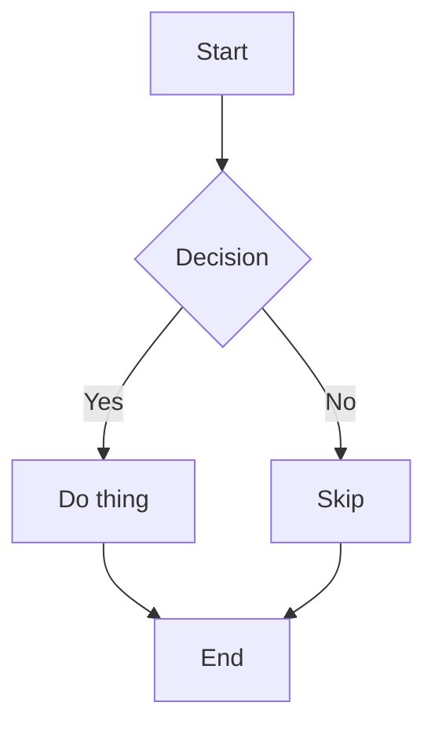

<!-- Collection: test -->
<!-- Title: Markdown Reference -->
<!-- Icon: book -->

# Markdown Reference for Outline

This document shows all supported markdown elements and how Outline renders them.

## Metadata Headers

outline-cli supports HTML comment headers at the top of markdown files:

```markdown
<!-- Collection: test -->
<!-- Title: My Document -->
<!-- Icon: rocket -->
<!-- Parent: Parent Document Title -->
```

- **Collection** (required unless `--collection-id` flag is set): target collection name, slug, or UUID
- **Title** (optional): document title — falls back to first H1 heading, then filename
- **Icon** (optional): document icon shown in Outline's sidebar and breadcrumbs
- **Parent** (optional): title of parent document for nesting

### Icon values

Icons can be one of three types:

| Type | Example | Description |
|------|---------|-------------|
| Outline SVG | `pencil`, `rocket`, `code` | Built-in named icons (preview in Outline's icon picker) |
| FontAwesome | `github`, `docker`, `python` | [Browse FA icons](https://fontawesome.com/search?o=r&m=free&s=solid%2Cbrands) (use kebab-case name) |
| Emoji | `📝`, `🚀` | Any unicode emoji character |

<details>
<summary>All built-in SVG icon names</summary>

| Name | Keywords |
|------|----------|
| `academicCap` | learn, teach, tutorial, training |
| `beaker` | lab, research, experiment, test |
| `bicycle` | bike, cycle |
| `bookmark` | bookmark |
| `browser` | browser, web, app |
| `buildingBlocks` | app, blocks, product, prototype |
| `camera` | photo, picture |
| `carrot` | food, vegetable |
| `clock` | time |
| `cloud` | cloud, service, aws, infrastructure |
| `code` | developer, api, engineering, programming |
| `coins` | money, finance, sales, revenue |
| `collection` | collection |
| `database` | server, ops, database |
| `done` | checkmark, success, complete |
| `email` | email, at |
| `eye` | eye, view |
| `feedback` | faq, help, support |
| `flame` | fire, hot |
| `globe` | world, translate |
| `graph` | chart, analytics, data |
| `hashtag` | social, media, tag |
| `icecream` | food, dessert |
| `image` | image, photo, picture |
| `info` | info, information |
| `internet` | network, global, globe |
| `leaf` | plant, nature, ecosystem, climate |
| `letter` | letter |
| `library` | library, collection, archive |
| `lightbulb` | idea |
| `lightning` | fast, zap |
| `math` | math, formula |
| `moon` | night, dark |
| `notepad` | journal, write, notes |
| `padlock` | private, security, auth |
| `palette` | design, art, brand |
| `pencil` | copy, writing, post, blog |
| `plane` | airplane, travel, flight, vacation |
| `promote` | marketing, promotion |
| `question` | question, help, faq |
| `ramen` | soup, food, noodle, meal |
| `server` | ops, infra, server |
| `shapes` | blocks, toy |
| `smiley` | emoji, happy |
| `sport` | sport, outdoor, game |
| `sun` | day, weather |
| `target` | target, goal, sales |
| `team` | team, building, organization |
| `terminal` | terminal, code |
| `thumbsup` | like, favorite, upvote |
| `tools` | tool, settings |
| `truck` | truck, transport |
| `vehicle` | truck, car, travel |
| `warning` | warning, alert, error |

</details>

<details>
<summary>All FontAwesome icon names</summary>

Browse with previews: [fontawesome.com/search](https://fontawesome.com/search?o=r&m=free&s=solid%2Cbrands)

| Name | | Name | | Name |
|------|---|------|---|------|
| `apple` | | `dog` | | `pizza-slice` |
| `android` | | `dollar-sign` | | `prescription` |
| `bag-shopping` | | `dropbox` | | `puzzle-piece` |
| `bluesky` | | `droplet` | | `python` |
| `book` | | `face-dizzy` | | `rainbow` |
| `brush` | | `face-grin-stars` | | `record-vinyl` |
| `cake` | | `face-laugh` | | `road` |
| `cat` | | `face-meh` | | `robot` |
| `circle` | | `face-smile-beam` | | `rocket` |
| `clapperboard` | | `face-smile-wink` | | `sailboat` |
| `codepen` | | `face-surprise` | | `scissors` |
| `compact-disc` | | `feather` | | `seedling` |
| `cookie-bite` | | `fish` | | `shield` |
| `crow` | | `flask-vial` | | `shirt` |
| `crown` | | `folder-closed` | | `shop` |
| `cube` | | `gamepad` | | `shopify` |
| `diamond` | | `gauge` | | `slack` |
| `discord` | | `gem` | | `snowflake` |
| `display` | | `gift` | | `socks` |
| `dna` | | `github` | | `solar-panel` |
| `docker` | | `gitlab` | | `spa` |
| `hammer` | | `hands-clapping` | | `spiral` |
| `heart` | | `hexagon` | | `square` |
| `industry` | | `kit-medical` | | `square-js` |
| `laptop` | | `laptop-code` | | `star-and-crescent` |
| `magnet` | | `map` | | `star-of-life` |
| `microchip` | | `mountain-sun` | | `sterling-sign` |
| `mug-hot` | | `network-wired` | | `swatchbook` |
| `newspaper` | | `paint-roller` | | `swift` |
| `passport` | | `paw` | | `tent` |
| `paypal` | | `pen-ruler` | | `tooth` |
| `pentagon` | | `peso-sign` | | `tower-cell` |
| `phone-volume` | | `tractor` | | `train` |
| `tree` | | `trophy` | | `umbrella` |
| `umbrella-beach` | | `universal-access` | | `user-graduate` |
| `utensils` | | `vault` | | `wand-sparkles` |
| `web-awesome` | | `wheelchair-move` | | `windows` |
| `worm` | | `x-twitter` | | `yen-sign` |

</details>

## Headings

# H1 Heading
## H2 Heading
### H3 Heading
#### H4 Heading

## Task Lists

- [ ] Unchecked task
- [x] Completed task
- [ ] Another task

## Bullet Lists

* First bullet
* Second bullet
* Third bullet

## Ordered Lists

1. First item
2. Second item
3. Third item

## Images

Reference local images relative to the markdown file:


When pushed, local images are automatically uploaded and the reference is rewritten
to an Outline attachment URL.

You can also specify dimensions (Outline extension):

```markdown

```

## File Attachments

Files are represented as links with size:

```markdown
[filename.pdf 716772](/api/attachments.redirect?id=<uuid>)
```

## Tables

| Column A | Column B | Column C |
|----------|----------|----------|
| cell 1   | cell 2   | cell 3   |
| cell 4   | cell 5   | cell 6   |

## Blockquotes

> This is a blockquote. Use it for callouts or citations.

## Code Blocks

Inline: `code here`

Fenced with language:

```python
def hello():
    print("world")
```

## Math (LaTeX / KaTeX)

Inline math is not directly supported in the editor but block math uses:

$$
x + y = \sqrt{z}
$$

## Callouts / Notices

:::info
This is an info notice — use for general information.
:::

:::success
This is a success notice — use for positive confirmations.
:::

:::warning
This is a warning notice — use for caution messages.
:::

:::tip
This is a tip notice — use for helpful suggestions.
:::

## Horizontal Rules

Use `---` or `***`:

---

## Collapsible Sections

Outline uses `+++++` delimiters for toggle/collapsible blocks:

+++++
Summary text here

Hidden content that expands when clicked.

+++++

## Mermaid Diagrams



## Dates and Times

Outline renders dates/times from its editor, stored as plain text:

```
May 11, 2026
5:14 PM
```

## Links

Standard markdown links:

```markdown
[Link text](https://example.com)
```

## Bold / Italic / Strikethrough

```markdown
**bold**
*italic*
~~strikethrough~~
```

**bold** *italic* ~~strikethrough~~
